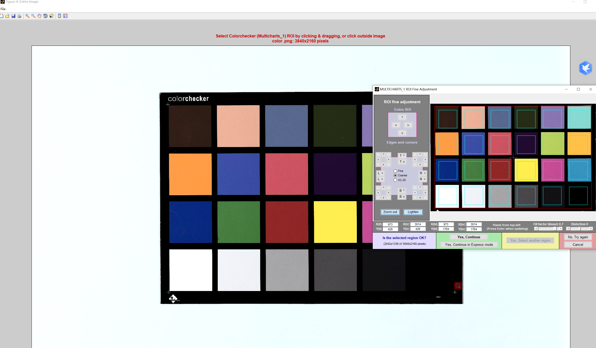

# 新模组性能摸底

## 色彩

工具：

​	24色卡，色温与亮度可调光源

方式：

​	新模组统一在由亮变暗和由暗变亮的环境中采集24色卡数据，完成后更换光源色温并重复采集。统一比对采集图像寻找异常。人工无法确定的数据使用imatest软件测试，比对测试结果。

要求：

​	1.采集时模组尽量保持位置不变，色卡位置不变，图卡占据整幅画面1/3即可，防止LSC影响，；

​	2.光源调节亮度时分3档，每档调节完毕后静止1分钟等待收敛；

​	3.人工无法确定模组是否偏色时（差距不大可认为正常误差），根据实际使用情况决定是否使用软件判定，软件测试不同模组的最终结果必定有区别。

Imatest使用与解读：

​	打开Imatest后进入Colorcheck模块，选择采集的24色卡数据，并进入ROI选择界面，调整框选位置，确认参数无误后进行测量，白平衡误差往往在灰色块中最为明显（底行 2-5）。 对于 S < 0.02，它几乎不可见。 S > 0.10 是相当严重的，特别是对于较浅的灰色块。 

​	区域 1 是所拍摄的色块。 区域 2 的方块是色块的参考值，根据所拍摄图表 **\*的亮度***进行 **\*校正***。 区域3是没有亮度校正的色块的理想值。对于所有色块，区域 2 的亮度将始终比区域 3 更亮或更暗，具体取决于曝光。 

[^白平衡误差]: 

​	ΔC00（ΔC2000）：忽略亮度的颜色误差；

​	HSV Saturation S：HSV颜色模型， *S 的*值可以介于 0 （表示完美的中性灰色）和 1 之间的值（表示完全饱和的颜色）。 *S*对应的感知色差取决于颜色空间。  

​	白平衡误差往往在 灰色块中最为明显（底行 2-5）。 对于 S < 0.02，它几乎不可见。 S > 0.10 是相当严重的，特别是对于较浅的灰色块。 

[^测量结果]: 

[^软件全局]: 

[^选择测试ROI]: 

[^选择测量结果单位、图卡格式和其他参数]: 

## 畸变

工具：

​	棋盘格测试卡

方式：

​	新模组统一在单一明亮光源下采集棋盘格数据。